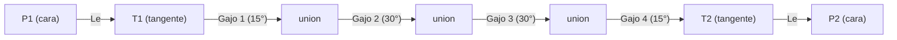

# Geometría del codo segmentado (V0.2)

Este documento describe `core/geometry/segmented_elbow.py`, el motor
matemático que construye la geometría 3D real de un codo HDPE segmentado
(gajos + tramos rectos + planos de corte a inglete), y sus consumidores
(`core/geometry/tube_mesh.py` para la malla de preview, `cad/backends/
cadquery_backend.py` para el sólido CAD, `core/geometry/
geometry_validation.py` para el autochequeo).

No sustituye a `core/geometry/elbow_geometry.py` (V0.1): ese módulo sigue
intacto y sigue alimentando la vista 2D de validación dimensional.

## 1. Sistema de coordenadas

Todo se construye en un marco local, con el **vértice teórico** (la
intersección de los dos ejes de tubería, si no existiera el codo) en el
origen:

- Eje 1 (hacia P1): dirección fija `dir1 = (-1, 0, 0)` — 180° en el plano XY.
- Eje 2 (hacia P2): `dir2 = (cos(ángulo), sin(ángulo), 0)`.
- El codo es plano: todo el cálculo ocurre en el plano local XY (`z=0`).
  Esto es consistente con los datos del catálogo (DIN 16963 solo define
  codos planos, sin ángulo de salida del plano); un codo espacial /
  compuesto queda fuera de alcance de V0.2.

```
                    P2
                     \
                      \  dir2
                       \
                        * <- vértice teórico (origen)
                       /
                      /  dir1
                     /
                   P1
```

**Importante — dos convenciones de dirección distintas conviven aquí, y
confundirlas es la fuente de un bug real que este proyecto tuvo (ver
`core/geometry/geometry_validation.py`, comentario del check 1):**

- **Dirección "de puerto" (outward)**: `dir1`, `dir2` — apuntan *desde* el
  vértice *hacia afuera*, a través de la cara del puerto. Es la
  convención de `Port.direction` (heredada de V0.1). El ángulo entre
  `dir1` y `dir2` es **`180° - ángulo`**, no el ángulo del codo.
- **Dirección "de flujo"**: la dirección real `axis_start -> axis_end` de
  cada pieza (`leg1_stub.direction`, cada `ElbowSegment.direction`,
  `leg2_stub.direction`). El ángulo entre `leg1_stub.direction` y
  `leg2_stub.direction` **sí** es igual a `angle_deg` — es la magnitud
  físicamente correcta para comparar contra el ángulo solicitado.

## 2. Definiciones (R, Le, Z)

- **R (`radius_mm`)**: radio de curvatura del codo, tal como figura en
  `BD_Codos`. Nunca se recalcula (el catálogo ya trae valores redondeados
  de fábrica); se usa tal cual como el radio del círculo sobre el que se
  apoyan los gajos.
- **Le (`le_mm`)**: longitud recta mínima ("tramo tangente") en cada
  extremo del codo, antes de que empiece la zona segmentada. Se modela
  como una pieza más (`leg1_stub`, `leg2_stub`), no como un simple offset.
- **Z (`z_mm`)**: distancia, medida desde el vértice teórico, hasta la
  cara de cada extremo del codo (P1 o P2). Es simétrica: la misma Z se
  usa para ambos lados.

## 3. Fórmula: Z = Le + R·tan(ángulo/2)

Verificada empíricamente contra las 4 × 21 combinaciones ángulo × DN de
`BD_Codos` (ver `tests/test_geometry.py::test_calculate_z_matches_catalog_value`
y `docs/DATA_NOTES.md`). **Se trata como una relación geométrica
verificada contra este Excel, no como una cita textual de DIN 16963** —
no se revisó el texto de la norma en sí.

Deducción: la tangente entre una recta y una circunferencia de radio R,
medida desde el punto donde ambas rectas (los dos ejes) se cruzan, tiene
longitud `t = R·tan(ángulo/2)`. Z es esa longitud tangente más el tramo
recto Le que la precede:

```
Z = Le + t,   t = R · tan(ángulo / 2)
```

## 4. Generación de segmentos (gajos)

Cada entrada del catálogo `Configuración` (p. ej. `15° - 30° - 30° - 15°`
para 90°) suma **exactamente** el ángulo total. Se interpreta
literalmente: **cada número es el arco, en grados, que ese gajo ocupa
sobre la misma circunferencia de radio R** ya usada para calcular la
tangente. Es la lectura más directa posible de un dato que ya cierra
exacto contra el total — no se asume ninguna convención adicional de
fabricación (p. ej. “ángulo de corte = mitad del giro”) que no esté en la
fuente.

```
offsets = [0, 15, 45, 75, 90]   (acumulado de 15,30,30,15)

joint_points[k] = arc_center + R · (cos(-90° + offsets[k]), sin(-90° + offsets[k]), 0)
```

`arc_center` es el mismo centro de arco que ya usaba `elbow_geometry.py`
en V0.1: `arc_center = (T1.x, T1.y + R)`, válido porque `dir1` está fijo
en 180°. Con esta construcción, `joint_points[0]` y `joint_points[-1]`
coinciden **exactamente** con los puntos de tangencia T1/T2 ya usados
para la vista 2D — no hay costura entre el modelo 2D y el 3D.



### Planos de corte (inglete)

Cada unión —incluidas las caras abiertas P1/P2— usa la **misma fórmula**:
el plano de corte en una unión es el que **bisecta** las direcciones de
flujo de las dos piezas que se encuentran ahí
(`normal = normalize(dirección_pieza_A + dirección_pieza_B)`). Esto
garantiza que las dos secciones (generalmente elípticas, por el ángulo)
encajen exactamente. En P1 y P2 no hay una segunda pieza real, así que se
"duplica" la dirección de la única pieza — la bisectriz de un vector
consigo mismo da un corte perpendicular a su propio eje, un extremo
abierto normal, no a inglete.

```
      pieza A dir ↘         ↙ pieza B dir
                    \       /
                     \     /
     ------------------ • ------------------   <- plano de corte
                (normal = bisectriz A+B)
```

### Caso sin desglose (30°)

Cuando la fuente no desglosa los segmentos (30° en el Excel entregado),
`segments = None` y **no se genera geometría de gajos**. Los dos tramos
rectos (`leg1_stub`, `leg2_stub`) siguen siendo válidos (Le, T1, T2 están
tabulados), así que se muestran igual — dejando un vacío real y visible
entre ellos en la vista 3D, en vez de inventar una curva.

## 5. Posición de P1 y P2

```
P1_face = vertice + dir1 · Z
P2_face = vertice + dir2 · Z
```

Los puertos (`Port.position_mm`) usan estas mismas caras. La dirección de
cada puerto (`Port.direction`) es la convención **outward** (`dir1`,
`dir2`) heredada de V0.1 — no la de flujo (ver sección 1).

## 6. Tolerancias

`core/geometry/geometry_validation.py` usa:

- `LINEAR_TOLERANCE_MM = 1e-6`
- `ANGULAR_TOLERANCE_DEG = 1e-6`

Deliberadamente muy por debajo de cualquier tolerancia de fabricación
real: esto es una construcción **analítica** (trigonometría exacta en
`float64`), no una medición. El objetivo del validador no es simular
tolerancia de manufactura, sino atrapar errores de implementación
(signos invertidos, radio incorrecto, ángulo de referencia equivocado)
antes de que lleguen al usuario. Ver el historial de
`core/geometry/geometry_validation.py`: un chequeo de ángulo comparaba
`dir1`/`dir2` (outward) contra `angle_deg` en vez de comparar las
direcciones de flujo — pasaba por casualidad en 90° (`sin 45° = cos 45°`)
y fallaba, correctamente, en 30°. La tolerancia ajustada no habría
evitado ese bug; solo la elección del vector correcto lo hizo.

Cualquier diferencia por encima de tolerancia levanta
`GeometryValidationError` (`GEOMETRY_VALIDATION_ERROR`) con el valor
esperado, el obtenido y la diferencia — nunca se ajusta en silencio.
